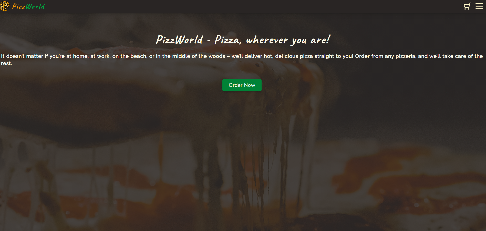

# Pizza App

Pizza App is a full-stack pizza ordering application built with a React frontend and an Express/MongoDB backend.

The app lets users browse a pizza menu, filter and sort available pizzas, manage a cart, go through a checkout flow, save a shipping address, place an order, and view order history from a user profile.

## Live Demo

> https://pizza-app-front-end.onrender.com

## Preview



## Features

- User registration, login, logout, and authentication check
- JWT-based authentication stored in an HTTP-only cookie
- Pizza menu fetched from the backend API
- Sorting pizzas by price and name
- Filtering pizzas by ingredients
- Cart state managed on the frontend
- Add pizzas to cart
- Remove pizzas from cart
- Increase and decrease pizza quantity in the cart
- Cart total calculation with a fixed delivery cost
- Multi-step checkout flow:
  - Cart
  - Address
  - Order summary
- Shipping address form connected to the backend
- Order creation for authenticated users
- Order history displayed in the user profile
- Profile image update flow with Cloudinary integration
- Toast notifications for user feedback
- Loading and error states for API requests

## Tech Stack

### Frontend

- React
- TypeScript
- Vite
- React Router
- TanStack React Query
- Zustand
- Tailwind CSS
- React Select
- React Hot Toast
- Lucide React
- React Responsive

### Backend

- Node.js
- Express
- TypeScript
- MongoDB
- Mongoose
- JWT
- bcrypt
- cookie-parser
- CORS
- Cloudinary
- dotenv

## Project Structure

```txt
Pizza-App/
├── backend/
│   ├── src/
│   │   ├── config/
│   │   ├── controllers/
│   │   ├── middlewares/
│   │   ├── models/
│   │   ├── routes/
│   │   ├── utils/
│   │   ├── server.js
│   │   └── server.ts
│   ├── package.json
│   └── tsconfig.json
│
├── frontend/
│   ├── public/
│   ├── src/
│   │   ├── components/
│   │   ├── features/
│   │   │   ├── Auth/
│   │   │   ├── Cart/
│   │   │   ├── Menu/
│   │   │   ├── Order/
│   │   │   ├── OrderHistory/
│   │   │   ├── ProfileImage/
│   │   │   └── ShippingAddress/
│   │   ├── layouts/
│   │   ├── pages/
│   │   │   ├── CartPage/
│   │   │   ├── HomePage/
│   │   │   ├── MenuPage/
│   │   │   ├── PageNotFound/
│   │   │   ├── ProfilePage/
│   │   │   └── SettingsPage/
│   │   ├── services/
│   │   ├── store/
│   │   ├── utils/
│   │   ├── App.tsx
│   │   ├── index.css
│   │   └── main.tsx
│   ├── package.json
│   └── vite.config.ts
│
├── package.json
└── README.md
```

## Getting Started

### Prerequisites

Make sure you have installed:

- Node.js
- npm
- MongoDB database, local or hosted
- Cloudinary account, if you want to use profile image uploads

## Installation

Clone the repository:

```bash
git clone https://github.com/AcePeQ/Pizza-App.git
cd Pizza-App
```

## Backend Setup

Go to the backend folder:

```bash
cd backend
npm install
```

Create a `.env` file inside the `backend` folder:

```env
PORT=5000
MONGODB_URI=your_mongodb_connection_string
JWT_SECRET_KEY=your_jwt_secret_key
NODE_ENV=development

CLOUDINARY_NAME=your_cloudinary_cloud_name
CLOUDINARY_KEY=your_cloudinary_api_key
CLOUDINARY_SECRET_KEY=your_cloudinary_api_secret
```

Run the backend in development mode:

```bash
npm run dev
```

Build the backend:

```bash
npm run build
```

Start the backend:

```bash
npm start
```

## Frontend Setup

Go to the frontend folder:

```bash
cd frontend
npm install
```

Create a `.env` file inside the `frontend` folder:

```env
VITE_API_BASE_URL=http://localhost:5000
```

Run the frontend in development mode:

```bash
npm run dev
```

Build the frontend:

```bash
npm run build
```

Preview the production build:

```bash
npm run preview
```

## Root Scripts

From the root folder, the project includes scripts for installing dependencies and building the frontend:

```bash
npm run build
npm start
```

## Available Scripts

### Backend

```bash
npm run dev    # Start backend in development mode with nodemon
npm run build  # Compile TypeScript
npm start      # Install dependencies, compile TypeScript, and start the backend
```

### Frontend

```bash
npm run dev      # Start Vite development server
npm run build    # Build frontend for production
npm run preview  # Preview the production build
npm run lint     # Run ESLint
```

## API Overview

### Authentication

```txt
POST /api/auth/signup
POST /api/auth/login
POST /api/auth/logout
POST /api/auth/update-profile
POST /api/auth/verifyAuth
```

### Menu

```txt
GET /api/menu/pizzaMenu
GET /api/menu/ingredients
```

The menu endpoint supports query parameters used by the frontend:

```txt
sortBy=price_ascending | price_descending | name_az | name_za
ingredients=ingredient1,ingredient2
```

### Account

```txt
GET  /api/account/shippingAddress
POST /api/account/updateShippingAddress
```

### Orders

```txt
POST /api/order/order
GET  /api/order/order-history
```

## Data Models

The backend uses MongoDB collections for:

- Users
- Pizzas
- Shipping addresses
- Orders

A user has authentication data and an optional profile picture. A pizza has a name, image, price, and ingredients. An order belongs to a user and stores ordered pizzas. A shipping address belongs to a user.

## Environment Variables

### Backend

| Variable | Description |
|---|---|
| `PORT` | Backend server port |
| `MONGODB_URI` | MongoDB connection string |
| `JWT_SECRET_KEY` | Secret key used to sign JWT tokens |
| `NODE_ENV` | Application environment, for example `development` or `production` |
| `CLOUDINARY_NAME` | Cloudinary cloud name |
| `CLOUDINARY_KEY` | Cloudinary API key |
| `CLOUDINARY_SECRET_KEY` | Cloudinary API secret |

### Frontend

| Variable | Description |
|---|---|
| `VITE_API_BASE_URL` | Base URL of the backend API |

## Author

Created by [AcePeQ](https://github.com/AcePeQ).
